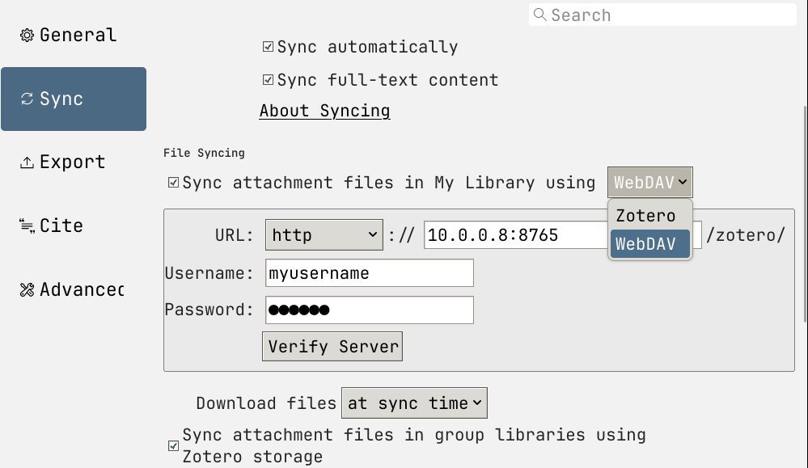

#+HUGO_BASE_DIR: ../../
#+HUGO_SECTION: posts
* posts
:PROPERTIES:
:EXPORT_FILE_NAME: _index
:EXPORT_HUGO_PUBLISHDATE:
:EXPORT_HUGO_EXPIRYDATE:
:EXPORT_AUTHOR: zhi
:EXPORT_HUGO_WEIGHT: auto
:EXPORT_HUGO_TYPE: posts
:END:

* DONE Zotero WebDav Server                                :zotero:@tutorial:
:PROPERTIES:
:EXPORT_FILE_NAME: index
:EXPORT_HUGO_BUNDLE: zotero-webdav
:EXPORT_DATE: <2026-08-17 Mon>
:EXPORT_HUGO_PUBLISHDATE:
:EXPORT_HUGO_EXPIRYDATE:
:EXPORT_AUTHOR: zhi
:EXPORT_HUGO_WEIGHT: auto
:EXPORT_HUGO_TYPE: posts
:EXPORT_OPTIONS: toc:2
:END:

[[https://www.zotero.org/][Zotero]] is a free, easy-to-use tool to help collect, organize,
and cite research papers. This is widely used, and really helpful
for graduate students / researchers.

What's nice is Zotero handles syncing of all the articles
you collected over the years as well as their attachments
(most likely PDFs of the corresponding article) on different machines.
The actual metadata of the articles that you saved are stored on the
zotero server for free, and to my knowledge, does *NOT* have a limit.
*However*, there is a limit on the attachment files stored on the Zotero server,
i.e. the actual PDFs for the articles. If you're on the free-plan,
the upper limit quota is 300MB. For 2GB storage, you would need $20 per year,
and 6GB for $60 per year. See pricing [[https://www.zotero.org/storage][here]].

If you want to avoid paying any subscription fees,
Zotero has an option of using a WebDav server in the setting.

#+name: fig:zotero-setting
#+attr_html: :width 100%
#+caption: Zotero setting page showing WebDav option

You can use webdav servers from various sources,
and zotero also keeps a sample list on their [[https://www.zotero.org/support/kb/webdav_services][website]].
However, it would be good if we can host our own
simple webdav server locally.
A simple way to accomplish is via =rclone=,
an open source command-line program that lets you manage and sync
files over different cloud storage services.
But you can also host your own webdav server from your local directory
via command =rclone serve webdav= command.

** WebDav server via rclone
First create a set of username and password that you will be
using to access the webdav server. Run

#+begin_src bash
  htpasswd -B -c <path-to-store-username-and-pw> <your-username>
#+end_src

A typical choice for path is =/etc/rclone/htpasswd=.
Once you have the username and password stored.
We can host the webdav server via

#+begin_src bash
rclone serve webdav <pathto-zotero-storage> \
  --addr 0.0.0.0:8080 \
  --htpasswd <path-to-store-username-and-pw> \
  --vfs-cache-mode writes
#+end_src

where you put where you want to store the zotero data and
the username and password that you set via =htpasswd=.
=--addr 0.0.0.0:8080= says webdav server listens to all machines on the same LAN,
and its port is =8080=. So you now from any machine connected on the same LAN,
you should be able to visit the webdav server in browser via
=http://<local-ip-hosting-webdav>:8080=. From there, it should prompt you
to enter the username and password. Note that it only hosts a simple webdav
server that does not allow you to upload files from the browser.
But we can now simple put these information in the Zotero setting,
and it should detect the server and will create a =/zotero= sub-directory there.

** Hosting as Docker Container
Now it is likely preferred to host the service via [[https://www.docker.com/][docker]] as containers.
Once you have docker installed and set upon your machine or home server,
you can easily spin up docker containers via docker compose,
which runs the service as a docker container according to the
docker compose yaml file.
A sample yaml file for hosting webdav server via =rclone= is

#+begin_src yaml
# /opt/zotero/docker-compose.yml
services:
  rclone-webdav:
    image: rclone/rclone:latest
    container_name: zotero-webdav
    restart: unless-stopped
    command: >
      serve webdav /data
      --addr :8080
      --htpasswd /config/htpasswd
      --vfs-cache-mode writes
    volumes:
      - <path-to-store-zotero>:/data
      - <path-to-store-username-and-pw>:/config/htpasswd:ro
    ports:
      - "<port>:8080"
#+end_src

A good place to organize all different docker containers is in
=/opt/=, i.e. simply store the above in =/opt/zotero/docker-compose.yml=.
With the docker compose file in place, to spin up the container, do

#+begin_src bash
docker compose up -d
#+end_src

Some notes:
1. If you want to put zotero storage on a NAS,
   then simply mount the NAS dataset on
   the machine hosting the container, something like
   =/mnt/nas/zotero/= and use that as =<path-to-store-zotero>=.
2. When hosting the webdav server in a container,
   it might also be convenient to create the username and password
   in the same directory as the =docker-compose.yml= file,
   i.e. =/opt/zotero/= for the case above.
3. You can choose an arbitrary port to access, under the =ports= section.

** Accessing outside of LAN
For current setup, we can only access the webdav server
when we're on the same network as the server hosting the
webdav server.
That being said, we want to be able to access and sync
Zotero files when we're outside of the home network.
To resolve this, we can simply use a VPN service
which will essentially put the client machine on the same network
as home server, which will then give access to the webdav server.

An extremely easy VPN service option is to use [[https://tailscale.com/][tailscale]].
Essentially create an account on their website,
register both the home server hosting different services and your client machines.
Doing this, all machines registered under the same network in the account
will see each other as if they're on the same network
once they have tailscale up and running.

Another popular self-host alternative is [[https://www.wireguard.com/][WireGuard]].
This requires a little more fiddling to set up, but this offers
more control over different network settings.

* DONE UML Diagram                                            :uml:@tutorial:
:PROPERTIES:
:EXPORT_FILE_NAME: index
:EXPORT_HUGO_BUNDLE: uml-diagram
:EXPORT_DATE: <2026-06-29 Mon>
:EXPORT_HUGO_PUBLISHDATE:
:EXPORT_HUGO_EXPIRYDATE:
:EXPORT_AUTHOR: zhi
:EXPORT_HUGO_WEIGHT: auto
:EXPORT_HUGO_TYPE: posts
:EXPORT_OPTIONS: toc:2
:END:

Unified Modeling Language (UML) diagram is a standardized visual
diagram used to design and document the structure and behavior
of complex software systems.
Here is [[https://www.youtube.com/watch?v=WnMQ8HlmeXc][YouTube video]] that talks about the diagram usage.
There are many different types of diagram, and here I
keep a record of them for my personal usage.

** UML Diagrams in Org-Mode
One of the ways to create a UML diagram in Org-Mode
is to use [[https://plantuml.com/][PlantUML]], a simple language used for writing
UML diagrams.

To use PlantUML, first install the language.
On Fedora, do

#+begin_src bash
  sudo dnf install plantuml
#+end_src

Now set up the emacs config file to set the path to the
plantuml.jar file. You can find where that is via

#+begin_src bash
  rpm -ql plantuml | grep -i jar
#+end_src

Now in the emacs config file, put

#+begin_src elisp
  ;; Set the path. Put whatever the previous command gives
  (setq org-plantuml-jar-path "/usr/share/java/plantuml.jar")

  ;; Loads the language plantuml language
  (org-babel-do-load-languages
   'org-babel-load-languages
   '((plantuml . t)))
#+end_src

Now we can run plantuml code in the org src code block.

#+begin_src text
  ,#+begin_src plantuml :file class_diagram.png
  class User {
  - String username
  - String password
  + login()
  + logout()
  }
  ,#+end_src
#+end_src

Now we can evalaute the src block via =C-c C-c=.

-----

** Class Diagram
A UML diagram gives you a visual relation between different
classes. See this [[https://www.youtube.com/watch?v=6XrL5jXmTwM][YouTube video]] for more detail.

A basic class object in the class diagram looks like:

#+begin_src plantuml :file uml-diagram/class_diagram.png
class User {
  - username: String
  - password: String
  # email: String
  ~ bio: String
  + login()
  + logout()
}
#+end_src

Each class have different attributes, 2nd row,
and different methods, 3rd row, which ends with =()=.
Now both attribute or method can have different levels
of /visibility/.

1. =-= private
2. =#= protected
3. =+= public
4. =~=  package/default

Now all we need to do is to connect different classes
together to create our diagram. There are different types
of relation between different classes.
Let's describe the common types:

| Relationship | Arrow Type        | Description                                   |
|--------------+-------------------+-----------------------------------------------|
| Inheritance  | Hollow Triangle   | One class is the subclass of another          |
| Association  | Straight Line     | Weakly related with each other                |
| Aggregation  | Hollow Diamond    | The part can exist independently of the whole |
| Composition  | Fulfilled Diamond | The part CANNOT exist withou the whole        |

-----

*** Inheritance
If a class is a subclass of another class -- inheritance.
Then we should connect the two via a /hollow triangular arrow/
pointing from the child class to the parent class.
Here is an example

#+begin_src plantuml :file uml-diagram/inheritance.png
class User {
  - userID: string
  - password: string
  - verifyLogin(): bool
}

class Customer {
  - customerName: string
  - creditCardInfo: string
  - accountBalance: float
  + register()
  + login()
}

User <|-- Customer
#+end_src

*** Association
If a class is only weakly associated with another class,
we can simply draw a /line/ between them. This can be used
to indicate that class A uses class B is some way.
This is typically when class B  is not directly stored
in class A, but class A uses class B as some argument
in one of the methods.
To expand upon the previous example, we can say /Customer/ buys
/Product/.

#+begin_src plantuml :file uml-diagram/association.png
class User {
  - userID: string
  - password: string
  - verifyLogin(): bool
}

class Customer {
  - customerName: string
  - creditCardInfo: string
  - accountBalance: float
  + register()
  + login()
}

class Product{
  - price: float
}
User <|-- Customer
Customer "buys" -- Product
#+end_src

*** Aggregation
Aggregation is when a class (A) can exist independently of the whole
(B). This is denoted by a hollow diamond shape
where the diamond is connected from class A to class B.
This likely when class B is stored as part of the attribute,
and it is created as an argument during initialization.
So that class B was already created.
We can again expand upon the previous example, where we
introduce a new class called /ShoppingCart/.
Now /ShoppingCart/ can contain 0 to many /Product/,
but /Product/ itself can live perfectly fine without /ShoppingCart/.
This is called an aggregation.

#+begin_src plantuml :file uml-diagram/aggregation.png
class User {
  - userID: string
  - password: string
  - verifyLogin(): bool
}

class Customer {
  - customerName: string
  - creditCardInfo: string
  - accountBalance: float
  + register()
  + login()
}

class Product {
  - price: float
}

class ShoppingCart {

}
User <|-- Customer
Customer "buys" -- Product
ShoppingCart "1" o-- "*" Product
#+end_src

*** Composition
Lastly, we have composition. This relation is similar to aggregation.
However, in this case the part (A) CANNOT exist without the whole (B).
This is denoted by a solid diamond shape.
This is when class A directly calls class B and stores it as
an attribute or somehow uses it inside class A.
From the previous example, consider an /Order/ object.
This depends on the /Customer/. But without /Customer/ there won't be any /Order/.
This is then a composition.

#+begin_src plantuml :file uml-diagram/aggregation.png
class User {
  - userID: string
  - password: string
  - verifyLogin(): bool
}

class Customer {
  - customerName: string
  - creditCardInfo: string
  - accountBalance: float
  + register()
  + login()
}

class Product {
  - price: float
}

class ShoppingCart {
}

class Order {
  }
User <|-- Customer
Customer "buys" -- Product
ShoppingCart "1" o-- "*" Product
Order --* Customer
#+end_src

-----

* DONE AMReX Basic Syntax                                   :amrex:@tutorial:
:PROPERTIES:
:EXPORT_FILE_NAME: index
:EXPORT_HUGO_BUNDLE: amrex-basics
:EXPORT_DATE: <2026-06-16 Tue>
:EXPORT_HUGO_PUBLISHDATE:
:EXPORT_HUGO_EXPIRYDATE:
:EXPORT_AUTHOR: zhi
:EXPORT_HUGO_WEIGHT: auto
:EXPORT_HUGO_TYPE: posts
:EXPORT_OPTIONS: toc:2
:END:

[[https://github.com/amrex-codes/amrex][AMReX]] is a public software framework designed for building
massively parallel block-structured adaptive mesh refinement applications.
Here I keep track of the basic syntax or classes used in AMReX
for my personal notes.

*Most are copied and paste from [[https://amrex-codes.github.io/amrex/docs_html/Introduction.html][AMReX documentaion]].*

Typing them down helps me go through the documentation
and filter out unnecessary information for my personal preference.

** Dimensionality Macros (=AMReX_SPACE.H=)
For a given problem, AMReX stores the dimensionality
of the problem via macro: =AMReX_SPACEDIM=.

- =AMReX_D_EXPR(a,b,c)=: evaluates the expression a,b,c based on =AMReX_SPACEDIM=, i.e. evaluates expression a only for DIM=1, a and b for DIM=2. Used to evaluate different expressions

  #+begin_src c++
    AMREX_D_EXPR(vect[0] *= s, vect[1] *= s, vect[2] *= s);
  #+end_src
- =AMREX_D_DECL(a,b,c)=: expands to a comma-separated list of, 1, 2,
  or 3 arguments based on =AMReX_SPACEDIM=. Mainly used to write portable
  function calls and declarations.

  #+begin_src c++
    return IntVect(AMREX_D_DECL(p[0] + s, p[1] + s, p[2] + s));
  #+end_src

  Then it evaluates to =IntVect(p[0]+s)= or =IntVect(p[0]+s, p[1]+s)=, etc...
- =AMREX_D_TERM(a,b,c)=: expands to a whitespace-separated list of, 1, 2,
  or 3 arguments based on =AMReX_SPACEDIM=.

  #+begin_src c++
    vol = AMREX_D_TERM(dx, *dy, *dz);
  #+end_src

  Then it evaluates to =vol=dx= or =vol=dx*dy= or =vol=dx*dy*dz=.
- =AMReX_D_PICK(a,b,c)=: expands to a single result equal to the
  1st, 2nd, or 3rd arguments of the call based on =AMReX_SPACEDIM=.

  #+begin_src c++
    maxsize = AMREX_D_PICK(1024, 128, 32);
  #+end_src

  This evaluates to 1024, 128, *OR* 32.

-------

** ParallelDescriptor (=AMReX_ParallelDescriptor.H=)
Mainly used functions are

#+begin_src c++
  // Return the rank
  int myproc = ParallelDescriptor::MyProc();

  // Return the number of processes
  int nprocs = ParallelDescriptor::NProcs();

  if (ParallelDescriptor::IOProcessor()) {
      // Only the I/O process executes this
      // Mainly used to do printing
      std::cout << "Some info..." << std::endl;
  }

  int ioproc = ParallelDescriptor::IOProcessorNumber();  // I/O rank

  // Wait until all MPI ranks have reached here.
  // Ensure all ranks have finished some operation before continuing.
  ParallelDescriptor::Barrier();

  // Broadcast 100 ints from the I/O Processor
  Vector<int> a(100);
  ParallelDescriptor::Bcast(a.data(), a.size(),
                      ParallelDescriptor::IOProcessorNumber())

  // See AMReX_ParallelDescriptor.H for many other Reduce functions
  ParallelDescriptor::ReduceRealSum(x);
#+end_src

---
** AMReX Array Types
- Vector (=AMReX_Vector.H=): basically =std::vector= but provides bound-checking
  when compiled with =DEBUG=TRUE=.

  #+begin_src c++
    amrex::Vector<amrex::Real> myvector {1.0_rt, 2.0_rt};
  #+end_src
- Array (=AMReX_Array.H=): basically =std::array=. 0-based index 1D array.

  #+begin_src c++
    amrex::Array<amrex::Real, 3> arr {1.0_rt, 2.0_rt, 3.0_rt};
  #+end_src
- GpuArray: Array marked with =AMREX_GPU_HOST_DEVICE=, so that it works on both HOST and DEVICE.
  But modern C++ after C++11 should make =std::array= compatible on both HOST and DEVICE.
  But it is still safer to use this. Access via =arr[2]=.

  #+begin_src c++
    amrex::GpuArray<amrex::Real, 3> arr {1.0_rt, 2.0_rt, 3.0_rt};
  #+end_src
- Array1D, Array2D, Array3D: GPU safe multidimensional views array in contiguous memory that
  can have non-zero based index. Access via =arr(1,2)=.

  #+begin_src c++
    amrex::Array2D<amrex::Real, 1, 2, 1, 3, amrex::Order::C> arr
                                        {{1.0_rt, 2.0_rt, 3.0_rt,
                                          4.0_rt, 5.0_rt, 6.0_rt}};
  #+end_src
---
** IntVect (=AMReX_IntVect.H=)
=IntVect=: integer vector in =AMREX_SPACEDIM= dimensional space.
It essentially records the index representing a given cell.

#+begin_src c++
  amrex::IntVect iv(AMREX_D_DECL(i, j, k));
  iv[0] == i;
  iv[1] == j;
  iv[2] == k;
#+end_src

It is essentially

#+begin_src c++
    int vec[AMREX_SPACEDIM];
#+end_src

*** Arithmetic Operations
#+begin_src c++
  IntVect iv(AMREX_D_DECL(19, 0, 5));
  IntVect iv2(AMREX_D_DECL(4, 8, 0));
  iv += iv2;  // iv is now (23,8,5)
  iv *= 2;    // iv is now (46,16,10);
#+end_src

*** Refinement and Coarsening
AMR codes often need to deal with refinement and coarsening.
The refinement operation can be done simply using the
multiplication operation or , i.e.

#+begin_src c++
  IntVect iv(AMREX_D_DECL(127,127,127));
  IntVect rr(AMREX_D_DECL(2,2,2,));

  // Refine all component by 2
  iv *= 2;

  // Or use refine function?
  iv.refine(rr);
#+end_src

For coarsening, one should ideally use builtin =coarsen= function.
For example, ~i=-1/2~ would give ~i=0~, but what we usually want is ~i=-1~.

#+begin_src c++
  IntVect iv(AMREX_D_DECL(127,127,127));
  IntVect coarsening_ratio(AMREX_D_DECL(2,2,2));
  iv.coarsen(2);                 // Coarsen each component by 2
  iv.coarsen(coarsening_ratio);  // Component-wise coarsening

  // Return an IntVect w/o modifying iv
  const auto& iv2 = amrex::coarsen(iv, 2);

  // iv not modified
  IntVect iv3 = amrex::coarsen(iv, coarsening_ratio);
#+end_src

---
** IndexType (=AMReX_IndexType.H=)
This class defines whether an index is cell-based or node-based along
each dimesion. Default is to use cell-based.

One can construct =IndexType= with an =IntVect= with:
- /0/: Cell-centered
- /1/: Node-centered

#+begin_src c++
  // Node centered in x-dir and cell-centered in y and z-dir
  IndexType xface(IntVect{AMREX_D_DECL(1,0,0)});
#+end_src

This class provides other useful functions to tell whether its node or cell centered.

#+begin_src c++
  // True if the IndexType is cell-based in all directions.
  bool cellCentered () const;

  // True if the IndexType is cell-based in dir-direction.
  bool cellCentered (int dir) const;

  // True if the IndexType is node-based in all directions.
  bool nodeCentered () const;

  // True if the IndexType is node-based in dir-direction.
  bool nodeCentered (int dir) const;
#+end_src

---
** Box (=AMReX_Box.H=)
A =Box= defines a rectangular indexing region of =AMREX_SPACEDIM= dimension.
It has 2 components:

1. An =IndexType= defining whether it is cell-centered or node-centered
2. Two =IntVect= defining the lower and upper corners of the rectangular region.

A typical way of defining the =Box= is the following

#+begin_src c++
  IntVect lo(AMREX_D_DECL(64,64,64)); // Lower corner
  IntVect hi(AMREX_D_DECL(127,127,127)); // Upper corner
  IndexType typ({AMREX_D_DECL(1,1,1)}); // Node center in all dir

  // Construct a cell-centered Box by default
  Box cc(lo,hi);

  // Construct a nodal Box, where we explicitly pass in IndexType
  Box nd(lo,hi+1,typ);
#+end_src

We can convert =Box= from cell-centered to node-centered via

#+begin_src c++
  // Construct all cell-centered box by default
  Box b0 ({64,64,64}, {127,127,127});

  // Convert cell-centered box to node-centered.
  Box b1 = surroundingNodes(b0);  // A new Box with type (node, node, node)
  Print() << b1;                  // ((64,64,64) (128,128,128) (1,1,1))
  Print() << b0;                  // Still ((64,64,64) (127,127,127) (0,0,0))

  // Convert the node-centered box to cell-centered again
  Box b2 = enclosedCells(b1);     // A new Box with type (cell, cell, cell)
  if (b2 == b0) {                 // Yes, they are identical.
      Print() << "b0 and b2 are identical!\n";
   }

  // Use convert() to not have uniform cell- or node-centered box
  Box b3 = convert(b0, {0,1,0});  // A new Box with type (cell, node, cell)
  Print() << b3;                  // ((64,64,64) (127,128,127) (0,1,0))

  b3.convert({0,0,1});            // Convert b0 to type (cell, cell, node)
  Print() << b3;                  // ((64,64,64) (127,127,128) (0,0,1))

  b3.surroundingNodes();          //  ((64,64,64) (128,128,128) (1,1,1))
  b3.enclosedCells();             //  ((64,64,64) (127,127,127) (0,0,0))
#+end_src

Sometimes given a =Box=, we want to know its corners. There are multiple ways
to do this

#+begin_src c++
    Box bx ({64,64,64}, {127,127,127});

    // Get the small end (lower corner) of the Box
    IntVect lo = bx.smallEnd();

     // Get the big end (upper corner) along y-dir
    bx.bigEnd(1);

    // Get const pointer the lower end and upper end (Legacy interface)
    const int* lo = bx.loVect();
    const int* hi = bx.hiVect();

    // Use lbound and ubound to get lower and upper corner
    // they return Dim3 instead of IntVect -- prefered for GPU access
    const Dim3 lo = lbound(bx);
    const Dim3 hi = ubound(bx);
#+end_src

Lastly, we want to do refinement and coarsen of a given =Box=.
Note that the behavior depends on whether the =Box= is cell-centered or node-centered.
A refined =Box= always covers the same physical domain as the original =Box=.
A coarsened =Box= does *NOT* always cover the same physical domain -- see example below.

#+begin_src c++
  // Cell-centered Box
  Box ccbx ({16,16,16}, {31,31,31});
  ccbx.refine(2);
  Print() << ccbx;              // ((32,32,32) (63,63,63) (0,0,0))
  Print() << ccbx.coarsen(2);   // ((16,16,16) (31,31,31) (0,0,0))

  // Node-centered Box
  Box ndbx ({16,16,16}, {32,32,32}, {1,1,1});
  ndbx.refine(2);
  Print() << ndbx;              // ((32,32,32) (64,64,64) (1,1,1))
  Print() << ndbx.coarsen(2);   // ((16,16,16) (32,32,32) (1,1,1))

  // Node-centered in x-dir
  Box facebx ({16,16,16}, {32,31,31}, {1,0,0});
  facebx.refine(2);
  Print() << faceb x;           // ((32,32,32) (64,63,63) (1,0,0))
  Print() << facebx.coarsen(2); // ((16,16,16) (32,31,31) (1,0,0))

  // Uncoarsenable Box
  Box uncbx ({16,16,16}, {30,30,30});
  Print() << uncbx.coarsen(2);  // ((8,8,8), (15,15,15));
  Print() << uncbx.refine(2);   // ((16,16,16), (31,31,31));
                                // Different from the original!
#+end_src

One can also expand a given box -- this is almost always used to
get the ghost cells.

#+begin_src c++
  // Increase a box in all directions by 2 cells,
  // basically the lower corners are subtracted by 2 in all dir
  // and upper corners are added by 2 in all dir
  const Box& obx = amrex::grow(bx, 2);

  // Only expand in y-dir by 4 cells.
  const Box& qbx = amrex::grow(bx, 1, 4);

  // Only grow the lower and upper corner
  // One can also use negative values to do 'shrink'
  Box gbx = amrex::growLo(bx, 1, 3);
  Box gbx = amrex::growHi(bx, 1, 3);
#+end_src

---
** Dim3 and XDim3
These are plain structs are holds 3 fields: =x,y,z=.

#+begin_src c++
  struct Dim3 { int x; int y; int z; };
  struct XDim3 { Real x; Real y; Real z; };
#+end_src

Note that they also have 3 fields regardless of dimensions.

And we see that =IntVect= can be easilly used to convert to =Dim3=.

#+begin_src c++
  IntVect iv(...);
  Dim3 d3 = iv.dim3();
#+end_src

Given a =Box=, it is often used to get upper and lower bound,
and use them to write a loop

#+begin_src c++
  Box bx(...);
  Dim3 lo = lbound(bx);
  Dim3 hi = ubound(bx);
  for (int k = lo.z; k <= hi.z; ++k) {
      for (int j = lo.y; j <= hi.y; ++j) {
          for (int i = lo.x; i <= hi.x; ++i) {
          }
      }
   }
#+end_src

---
** RealBox (=AMReX_RealBox.H=)
A =RealBox= stores the /physical/ location in floating-point numbers of the
lower and upper corners of a rectangular domain, rather than storing
indices compared to =Box=.

#+begin_src c++
  // A rectangular box whose length is [-1.0, 1.0] for each dir.
  RealBox rb({AMREX_D_DECL(-1.0,-1.0,-1.0)},
             {AMREX_D_DECL( 1.0, 1.0, 1.0)});

  // Lower and upper corner in physical location.
  // One can also specify dir.
  auto lo = rb.lo();
  auto hi = rb.hi();
#+end_src

---
** Geometry (=AMReX_Geometry.H=)
With the =Box= and =RealBox= specified, we can now create the =Geometry=.

#+begin_src c++
  int n_cell = 64;

  // This defines a Box with n_cell cells in each direction.
  Box domain(IntVect{AMREX_D_DECL(       0,        0,        0)},
             IntVect{AMREX_D_DECL(n_cell-1, n_cell-1, n_cell-1)});

  // This defines the physical box, [-1,1] in each direction.
  RealBox real_box({AMREX_D_DECL(-1.0,-1.0,-1.0)},
                   {AMREX_D_DECL( 1.0, 1.0, 1.0)});

  // This says we are using Cartesian coordinates
  int coord = 0;

  // This sets the boundary conditions to be doubly or triply periodic
  Array<int,AMREX_SPACEDIM> is_periodic {AMREX_D_DECL(1,1,1)};

  // This defines a Geometry object
  Geometry geom(domain, real_box, coord, is_periodic);
#+end_src

Now we normally want a =Geometry= object for every AMR-level.
Hence, the =Box= and =RealBox= here represents the full-domain of that level.
Every level needs a =Geometry= object since stuff like =CellSize=, =volume= differs.
Here are some information you can get from =Geometry=

#+begin_src c++
  // Lower corner of the physical domain
  // Returns GpuArray<Real,AMREX_SPACEDIM>
  const auto problo = geom.ProbLoArray();

  // y-direction upper corner
  Real yhi = geom.ProbHi(1);

  // Cell size for each direction.
  const auto dx = geom.CellSizeArray();

  // Index domain -- the Box containing upper lower indices
  const Box& domain = geom.Domain();

  // Is periodic in x-direction?
  bool is_per = geom.isPeriodic(0);
#+end_src

---
** BoxArray (=AMReX_BoxArray.H=)
=BoxArray= is a collection of =Boxes=.
You can create a =BoxArray= from a single =Box=, i.e. a single =Box=
representing the full domain. And then chop up the =BoxArray=
into smallers =Box=.

#+begin_src c++
  // Create a Box representing the full domain
  Box domain(IntVect{0,0,0}, IntVect{127,127,127});

  // Make a new BoxArray out of a single Box
  BoxArray ba(domain);

  // Get the number of boxes in the BoxArray, which is 1 for now.
  Print() << "BoxArray size is " << ba.size() << "\n";

  // Forces each Box in BoxArray to have sides <= maxSize
  // so chop up the single Box into smaller boxes 64^3 cells
  ba.maxSize(64);
  Print() << ba; // Now shows 8 Boxes
#+end_src

One thing to note is that =BoxArray= is a /global data structure/.
This means that all processes knows about the whole =BoxArray=.
It holds all Boxes in a collection, but a single process in parallel
can only own /some/ of its Boxes via domain decomposition -- this
refers to the actual data, i.e. =FArrayBox= or FAB, see next few sections.

Similar to =Box=, =BoxArray= has an =IndexType=, and /all/ Boxes in the =BoxArray=
will have same type as the =BoxArray= itself. One can convert the
=IndexType= of a =BoxArray= via

#+begin_src c++
  // Create a cell-centered BoxArray from a single Box
  BoxArray cellba(Box(IntVect{0,0,0}, IntVect{63,127,127}));

  // Chop up BoxArray so that the length of each Box is < 64
  cellba.maxSize(64);

  // Make a copy
  BoxArray faceba = cellba;

  // Convert BoxArray to index type (cell, cell, node)
  faceba.convert(IntVect{0,0,1});

  // Return an all node BoxArray
  const BoxArray& nodeba = amrex::convert(faceba, IntVect{1,1,1});

  // We can access individual Box in BoxArray via []
  // Note that it returns by VALUE instead of REFERENCE
  Print() << cellba[0] << "\n";  // ((0,0,0) (63,63,63) (0,0,0))
  Print() << faceba[0] << "\n";  // ((0,0,0) (63,63,64) (0,0,1))
  Print() << nodeba[0] << "\n";  // ((0,0,0) (64,64,64) (1,1,1))
#+end_src

=BoxArray= also allows all Boxes to be refined or coarsened via

#+begin_src c++
  BoxArray ba(Box(IntVect{0,0,0}, IntVect{63,127,127}));
  IntVect rr {2,2,4};

  // Refine each Box in BoxArray in all dir by 2
  ba.refine(2);

  // Different refinement ratio for each dir
  ba.refine(rr);

  // Coarsen each Box in BoxArray by 2
  ba.coarsen(2);
  ba.coarsen(rr);
#+end_src

---
** DistributionMapping (=AMReX_DistributionMapping.H=)
=DistributionMapping= uses an algorithm to describe which process
owns the data living on the domains specified by the Boxes in =BoxArray=.
One can construct a =DistributionMapping= given a =BoxArray=.

#+begin_src c++
  DistributionMapping dm {ba};
#+end_src

---
** BaseFab
=BaseFab= is a class containing multi-dimensional array data for a single =Box=.
This is like a step up of a =Box= where not only does it know about
lower and upper corner indices, it knows about the data specified in that region.
The dimensionality of the array is =AMREX_SPACEDIM+1=. The additional
dimension is to account for the number of components, say we have
density, momentum, and energy. Then we have 5 components.

#+begin_src c++
  // First create a single Box
  Box bx(IntVect{-4,8,32}, IntVect{32,64,48});

  // Specify the number of components
  int numcomps = 4;

  // Create the array
  BaseFab<Real> fab(bx,numcomps);
#+end_src

Now usually we don't work =BaseFab=, but classes derived from it.

- =FArrayBox= = =BaseFab<Real>=
- =IArrayBox= = =BaseFab<int>=

One can easily get the associated =Box= and the number of components via

#+begin_src c++
  // Get the Box
  Box bx = fab.box();

  // Get the number of components
  int ncomp = fab.nComp();
#+end_src

One can also change the =Box= and number of components a =FArrayBox= is defined on
via the =resize= method or =define= method. Both are accomplishes the same thing,
but use =define= when first constructing the object and =resize= when changing
an existing one.

#+begin_src c++
  // using define
  fab.define(box, ncomp);

  // using resize
  fab.resize(box, ncomp);
#+end_src

One can do simple arithmetic operations using builtin functions

#+begin_src c++
  // Create the Box and specify number of components
  Box box(IntVect{0,0,0}, IntVect{63,63,63});
  int ncomp = 2;

  // Create the ArrayBox holding the data
  FArrayBox fab1(box, ncomp);
  FArrayBox fab2(box, ncomp);

  // Fill fab1 with 1.0
  fab1.setVal(1.0);

  // Multiply component 0 by 10.0
  fab1.mult(10.0, 0);

  // Fill fab2 with 2.0
  fab2.setVal(2.0);

  // For all components, fab2 <- a * fab1 + fab2
  Real a = 3.0;
  fab2.saxpy(a, fab1);
#+end_src

For more complicated operations, one needs to work the array directly.
The actual 4D array object in a =BaseFab= class is contained using =Array4=.
Here is an example

#+begin_src c++
  // Given FArrayBox and IArrayBox
  FArrayBox afab(...), bfab(...);
  IArrayBox ifab(...);

  // Get the appropriate array containing data using fab.array()
  Array4<Real> const& a = afab.array();
  Array4<Real const> const b = bfab.const_array();
  Array4<int const> m = ifab.array();

  // Get the lower and upper bound indices of the Box
  // and the number of componenets
  Dim3 lo = lbound(a);
  Dim3 hi = ubound(a);
  int nc = a.nComp();

  // Do a 4D loop loop
  for (int n = 0; n < nc; ++n) {
      for (int k = lo.z; k <= hi.z; ++k) {
          for (int j = lo.y; j <= hi.y; ++j) {
              for (int i = lo.x; i <= hi.x; ++i) {
                  if (m(i,j,k) > 0) {
                      a(i,j,k,n) *= 2.0;
                  } else {
                      a(i,j,k,n) = 2.0*a(i,j,k,n) + 0.5*(b(i-1,j,k,n)+b(i+1,j,k,n));
                  }
              }
          }
      }
   }

  // Using ParallelFor instead of manual loop (GPU friendly)
  amrex::ParallelFor(bx, NUM_STATE,
  [=] AMREX_GPU_DEVICE (int i, int j, int k, int n) noexcept
  {
       if (m(i,j,k) > 0) {
           a(i,j,k,n) *= 2.0;
       } else {
           a(i,j,k,n) = 2.0*a(i,j,k,n) + 0.5*(b(i-1,j,k,n)+b(i+1,j,k,n));
       }
  }
#+end_src

---
** FabArray, MultiFab and iMultiFab
=FabArray= is a collection of =BaseFab=, similar to =BoxArray= is a collection of =Box=.
Similar to =BoxArray=. Similar to =BaseFab=, we usually don't work with =FabArray=
directly, but classes derived from it. This is usually

1. =MultiFab= = =FabArray<FArrayBox>>= = =FabArray<BaseFab<Real>>=
2. =iMultiFab= = =FabArray<IArrayBox>>= = =FabArray<BaseFab<int>>=

Now because =FabArray= is a parallel data structure where the data, i.e. =FArrayBox= or FAB,
are distributed among parallel processes. For each process, a =FabArray= contains only
the FAB objects owned by that process and only operates on that data.
For operations that require data owned by other processes, remote communications are needed,
so we =FabArray= needs =DistributionMapping= that specifies which process owns which Box.
So for each process, =FabArray= knows about the full =BoxArray=, but only the =FAB= that is assigned
to that process.

To create a =FabArray= or =MultiFab=,

#+begin_src c++
  // ba is BoxArray
  // dm is DistributionMapping
  // 4 components
  int ncomp = 4;

  // 1 ghost cell, so all Boxes have grown by 1 cell.
  // If BoxArray has Box{(7,7,7) (15,15,15)}
  // then the one used for FArrayBox in MultiFab
  // is then Box{(6,6,6) (16,16,16)}.
  int ngrow = 1;
  MultiFab mf(ba, dm, ncomp, ngrow);
#+end_src

When creating the =MultiFab=, we use the individual =Box= in  =BoxArray=
to create the individual =FArrayBox=. So a =MultiFab= contains both
=BoxArray= and a collection of =FArrayBox= which also knows about its
corresponding =Box=. Now usually these two =Box= are the same, except
when we create =MultiFab= with ghost cells.
Internally the =FArrayBox= is created via

#+begin_src c++
  // Create the FAB but with grown Box
  FArrayBox fab(amrex::grow(ba[0], ngrow),ncomp);
#+end_src

So the =Box= used to create the =FArrayBox= is enlarged, but the
=Box= stored in =MultiFab= stays unchanged and this is contains
the /valid zones/. And notice that =FArrayBox= itself doesn't have
the concept of ghost cells, it is simply allocated using a grown
=Box=.

For a given =MultiFab=, we can iterate through all the =FArrayBox=
via =MFIter=

#+begin_src c++
  for (MFIter mfi(mf); mfi.isValid(); ++mfi)
  {
      // Valid Box without ghost cells
      const Box& valid = mfi.validbox();

      // With ghost cells
      const Box& fabbx = mfi.fabbox();

      // Get the Array
      Array4<Real const> const& a = mf.array(mfi);

      Print() << valid << "\n";
      Print() << fabbx << "\n";
  }
#+end_src

We can also create a =MultiFab= from another =MultiFab=.

#+begin_src c++
      // mf0 is an already defined MultiFab
      // Get properties like the BoxArray and DistributionMap
      const BoxArray& ba = mf0.boxArray();
      const DistributionMapping& dm = mf0.DistributionMap();
      int ncomp = mf0.nComp();
      int ngrow = mf0.nGrow();

      // Create new MultiFabs with existing properties
      MultiFab mf1(ba,dm,ncomp,ngrow);

      // change the IndexType to face centered at x-dir for x-flux
      MultiFab xflux(amrex::convert(ba, IntVect{1,0,0}), dm, ncomp, 0);
#+end_src

We can also do some basic operations on a =MultiFab= or between
=MultiFab= built with the /same/ =BoxArray= and =DistributionMapping=.

#+begin_src c++
  // Minimum value in component 3 of MultiFab mf
  // no ghost cells included
  Real dmin = mf.min(3);

  // Maximum value in component 3 of MultiFab mf
  // including 1 ghost cell
  Real dmax = mf.max(3,1);

  // Set all values to zero including ghost cells
  mf.setVal(0.0);

  // Add mfsrc to mfdst
  MultiFab::Add(mfdst, mfsrc, sc, dc, nc, ng);

  // Copy from mfsrc to mfdst
  MultiFab::Copy(mfdst, mfsrc, sc, dc, nc, ng);

  // MultiFab mfdst: destination
  // MultiFab mfsrc: source
  // int  sc   : starting component index in mfsrc for this operation
  // int  dc   : starting component index in mfdst for this operation
  // int  nc   : number of components for this operation
  // int  ng   : number of ghost cells involved in this operation
  //             mfdst and mfsrc may have more ghost cells
#+end_src

Now the =BoxArray= used to define the =MultiFab= is usuallly non-intersecting,
except when due to a nodal index type. But if =MultiFab= has ghost cells,
then =FArrayBox= which was constructed via a grown =BoxArray= can have overlaps,
even though the =BoxArray= is still the original one, which means that
the =Box= from =FArrayBox= is larger than the one in =BoxArray=.
This means that parallel communication is needed to fill ghost cells
from other =FArrayBox= which can be possibly owned by a different process.
To do this, use =FillBoundary=

#+begin_src c++
  MultiFab mf(...parameters omitted...);
  Geometry geom(...parameters omitted...);

  // Fill ghost cells for all components
  // Periodic boundaries are not filled.
  mf.FillBoundary();

  // Fill ghost cells for all components
  // Periodic boundaries are filled.
  // This matters when grids are touching physical periodic boundaries.
  // Note that if physical boundary is not periodic, like outflow,
  // it just leaves them as garbage data since no grid overlap with ghost cells.
  mf.FillBoundary(geom.periodicity());

  // Fill 3 components starting from component 2
  mf.FillBoundary(2, 3);
  mf.FillBoundary(geom.periodicity(), 2, 3);
#+end_src

Another type of parallel communication is copying data from One
=MultiFab= to another =MultiFab= with a different or same  =BoxArray=
with a different =DistributionMapping=.
The copy will only be performed on the /regions of intersection/
as one would expect.

#+begin_src c++
  mfdst.ParallelCopy(mfsrc, compsrc, compdst, ncomp, ngsrc, ngdst, period, op);
#+end_src

---
** MFIter without Tiling
We previously discussed manipulating individual =FArrayBox= in =MultiFab=
using =MFIter=. Let's discuss this in more detail. Here is an example

#+begin_src c++
  for (MFIter mfi(mf); mfi.isValid(); ++mfi) // Loop over grids
  {
      // This is the valid Box of the current FArrayBox.
      // By "valid", we mean the original ungrown Box in BoxArray.
      const Box& box = mfi.validbox();

      // A reference to the current FArrayBox in this loop iteration.
      FArrayBox& fab = mf[mfi];

      // Obtain Array4 from FArrayBox.  We can also do
      //     Array4<Real> const& a = mf.array(mfi);
      Array4<Real> const& a = fab.array();

      // Call function f1 to work on the region specified by box.
      // Note that the whole region of the Fab includes ghost
      // cells (if there are any), and is thus larger than or
      // equal to "box".
      // So we don't have to worry about accessing data outside
      // of box when doing loops.
      f1(box, a);
  }

  // f1 operates on Box and can be something like
  void f1 (Box const& bx, Array4<Real> const& a) {
     // Or use ParallelFor...
     const auto lo = lbound(bx);
     const auto hi = ubound(bx);
     const int ncomp = a.nComp();
     for (int n = 0; n < ncomp; ++n) {
       for (int k = lo.z; k <= hi.z; ++k) {
         for (int j = lo.y; j <= hi.y; ++j) {
           for (int i = lo.x; i <= hi.x; ++i) {
             a(i,j,k,n) = ...;
           }
         }
       }
     }
  }
#+end_src

Here note that =MFIter= only loops over grid owned by this process.

We can also work with multiple =MultiFab= for a given loop. Note that
they need to have the same =DistributionMapping=, but not necessary
the same =BoxArray=, i.e. they can differ due to index types.

#+begin_src c++
  // U and F are MultiFabs
  for (MFIter mfi(F); mfi.isValid(); ++mfi) // Loop over grids
  {
      const Box& box = mfi.validbox();

      Array4<Real const> const& u = U.const_array(mfi);
      Array4<Real      > const& f = F.array(mfi);

      f2(box, u, f);
  }
#+end_src

---
** Loop Tiling
Let's first dicuss what is Loop Tiling
*** What is Loop Tiling?
Tiling, also known as cache blocking -- a loop transformation technique
for improving data locality. It transforms loops into tiles or smaller blocks
first and then do the looping within tiles.
The idea is that it minimizes reading data in memory.
Here is an online [[https://open-catalog.codee.com/Glossary/Loop-tiling/][webpage]] explaining loop tiling.

Before talking about loop tiling, let's first discuss
how CPU gets its data. Upon a memory request for CPU, it fetches the data
with following flow:

RAM (GBs) \rightarrow L3 (8-32MB) \rightarrow L2 (256KB-1MB) \rightarrow L1 (32-64KB) \rightarrow registers \rightarrow CPU

Also note that RAM is basically a 2D block of bytes where it has /N/ number
of rows and /M/ number of columns. Here /M/ is the /cache line size/,
which is typically 64 bytes, i.e. each row has 64 memory addresses.
For example, a single precision number uses 4 bytes and double precision
uses 8 bytes.
Now when a CPU fetches the desired data, it gets all data of that
specific row contains the data requested, i.e. it gets 64 bytes
of data every single time. Now this is why it is faster to access data
adjacent in memory address, since the neighboring data are already loaded in cache.

The order at which CPU checks whether data exists is the reverse order
of the above. Each level is smaller, faster and closer to the CPU.
Now once the data gets filled out in those levels, it gets removed
or /data eviction/ following some policies. The most common one is
/Least Recently Used/ or LRU, which removes data that is not used in the
longest time.

Now let's consider this example

#+begin_src c++
  for (int i = 0; i < n; i++) {
    for (int j = 0; j < m; j++) {
      c[i][j] = a[i] * b[j];
    }
   }
#+end_src

When doing this loop, CPU first gets a[0] and then subsequently loads
in b[0], b[1], b[2], ..., b[m]. Now if array /b/ is large, then the earlier
elements of array b gets removed since it exceeds the cache size.
But if array /b/ is small enough so that all elements can live within cache
without it being evicted, then we maximize speed.

Now consider array /a/ is small and array /b/ is large so that we just
need to do tiling on /b/. This means we can do the following:

#+begin_src c++
  for (int jj = 0; jj < m; jj += TILE_SIZE) {
    for (int i = 0; i < n; i++) {
      for (int j = jj; j < MIN(jj + TILE_SIZE, m); j++) {
        c[i][j] = a[i] * b[j];
      }
    }
   }
#+end_src

Now the access pattern goes like:
- (0,0) \rightarrow (0,1) \rightarrow ... \rightarrow (0, TILE_SIZE-1) \rightarrow
- (1,0) \rightarrow (1,1) \rightarrow ... \rightarrow (1, TILE_SIZE-1) \rightarrow
- ...
- (n-1,0) \rightarrow (n-1,1) \rightarrow ... \rightarrow (n-1, TILE_SIZE-1) \rightarrow
- (0,TILE_SIZE) \rightarrow (0,TILE_SIZE+1) \rightarrow ... \rightarrow (0, 2*TILE_SIZE-1) \rightarrow
- (1,TILE_SIZE) \rightarrow (1,TILE_SIZE+1) \rightarrow ... \rightarrow (1, 2*TILE_SIZE-1) \rightarrow
- ...

Now notice that we're accessing the same subset of array /b/,
from b[0] to b[TILZE_SIZE-1] over and over again. Assume
this is small enough, and so these elements never got evicted from cache.
Hence we eliminated the stall of waiting to fetch these data from RAM.
Now if array /a/ is also large, then we should do the same tiling on /a/,
which then looks like

#+begin_src c++
  for (int ii = 0; ii < n; ii += TILE_SIZE_I) {
    for (int jj = 0; jj < m; jj += TILE_SIZE_J) {
      for (int i = ii; i < MIN(n, ii + TILE_SIZE_I); i++) {
        for (int j = jj; j < MIN(m, jj + TILE_SIZE_J); j++) {
          c[i][j] = a[i] * b[j];
        }
      }
    }
  }
#+end_src

In this case, we would want the total tile size, /TILE_SIZE_I * TILE_SIZE_J/
to be small enough so that all these subset of array /a/ and /b/ can live in cache.
Now ideally we want the total size of the data for each tile to be smaller than
the L1 cache. However, we don't want the TILE_SIZE to be too small for two reasons:

1. Loop iterations have a fixed cost -- loop overhead.
2. Cache lines are underutilized -- fetch more data than actually used.

When should we use it?

1. Iterating over the same dataset multiple times
2. Cases with "wrong" memory access patterns that cannot be fixed with interchange
   of the loop index. An example is matrix tranposition

   #+begin_src c++
     for (int i = 0; i < n; i++) {
       for (int j = 0; j < n; j++) {
         // access to array a is column-major
         // use tiling to reduce time between
         // consecutive access to neighboring of array a
         b[i][j] = a[j][i];
       }
     }
   #+end_src

*** MFIter with Tiling
From previous example we see that the major downside
is that the syntax becomes ugly. But we can easily enable
tiling with the following synteax when looping over boxes.

#+begin_src c++
  //               * true *  turns on tiling
  for (MFIter mfi(mf,true); mfi.isValid(); ++mfi) // Loop over tiles
  {
      //                   tilebox() instead of validbox()
      const Box& box = mfi.tilebox();

      ...
  }
#+end_src

We can also specify the tile size when defining =MFIter=,

#+begin_src c++
  // No tiling in x-direction. Tile size is 16 for y and 32 for z.
  // The default tile size is IntVect(1024000,8,8)
  for (MFIter mfi(mf,IntVect(1024000,16,32)); mfi.isValid(); ++mfi) {...}
#+end_src

Note if the tile size is larger than the grid size, then it means
that tiling is disabled in that direction. So the example above
has no tiling in x-dir.

---
** ParallelFor
ParallelFor allows you to not manually write out all the loops when
iterating over a =Box=. This works on either GPU or CPU so its convenient to use.
Here is an example

#+begin_src c++
  #ifdef AMREX_USE_OMP
  #pragma omp parallel if (Gpu::notInLaunchRegion())
  #endif
    for (MFIter mfi(mfa,TilingIfNotGPU()); mfi.isValid(); ++mfi)
    {
      const Box& bx = mfi.tilebox();
      Array4<Real> const& a = mfa[mfi].array();
      Array4<Real const> const& b = mfb[mfi].const_array();
      Array4<Real const> const& c = mfc[mfi].const_array();

      // Assume a single component.
      ParallelFor(bx, [=] AMREX_GPU_DEVICE (int i, int j, int k)
      {
        a(i,j,k) += b(i,j,k) * c(i,j,k);
      });
    }
#+end_src

Here are some other versions

#+begin_src c++
  // 1D for loop
  ParallelFor(N, [=] AMREX_GPU_DEVICE (int i) { ... });

  // 4D for loop
  ParallelFor(box, numcomps,
              [=] AMREX_GPU_DEVICE (int i, int j, int k, int n) { ... });
#+end_src

---
* DONE GDB Tutorial                                           :gdb:@tutorial:
:PROPERTIES:
:EXPORT_FILE_NAME: index
:EXPORT_HUGO_BUNDLE: gdb-tutorial
:EXPORT_DATE: <2026-04-14 Tue>
:EXPORT_HUGO_PUBLISHDATE:
:EXPORT_HUGO_EXPIRYDATE:
:EXPORT_AUTHOR: zhi
:EXPORT_HUGO_WEIGHT: auto
:EXPORT_HUGO_TYPE: posts
:EXPORT_OPTIONS: toc:2
:END:

[[https://www.sourceware.org/gdb/][GDB]], the GNU Project debugger, is a useful debugger for many
languages (C, C++, Fortran, etc). Here I keep a set of useful
commands for my records.

** Using GDB
To use GDB, compile the program with debugging information.
For standard C++ program, add =-g= flag when compiling, i.e.
something like

#+begin_src bash
  g++ -g -o myprogram myprogram.cpp
#+end_src

For =AMReX= related application codes like =Castro=, compile with
=DEBUG=TRUE=, i.e.

#+begin_src bash
  make DEBUG=TRUE
#+end_src

Now launch GDB with compiled program as the following.

#+begin_src bash
  gdb myprogram
#+end_src

Now inside gdb, set breakpoints to tell GDB where to pause.
You can either set by line number of function name

#+begin_example
(gdb) break main         # Break at the beginning of the main function
(gdb) break 42           # Break at line 42
(gdb) break file.cpp:55  # Break at line 55 of a specific file
#+end_example

Now run the program via =run= command. If the program needs command-line
arguments, pass them after =run=, i.e. =inputs= in this case.

#+begin_example
  (gdb) run inputs
#+end_example

The program should stop at your breakpoints, use commands like =print= to
debug.

** Commands
Here are a set of useful commands that I keep track of:

- *run*: run the entire program from the beginning. Do `run arg1 arg2 ...`

- *break*: set a break point at a specific line of the program.
   We can also set it at the function name

- *list*: print out the lines of the code around where I am at if no
  input is given.
  You can also print out the code lines if you pass in the line number.

- *print*: prints out the variable

- *up*: Go up the call stack (the function that called the current function

- *down*: Go down the call stack.

- *display*: display variable for every command we run. Give the variable name.

- *undisplay*: stop displaying the variable,
  the input must be the ID number of the corresponding variable.

- *backtrace*: Print out the entire call stack.

- *step*: unlike next, it will go inside the function call.

- *continue*: continue running until the next break point.

- *finish*: run until the end of the function.

- *watch*: watch a variable, the it stops whenever the value of the
  watched value is changed.

- *info*: verstaile command, if the argument is breakpoint, then it
  lists out the breakpoint and watch that we set before.

- *delete*: deletes the breakpoint or watch point. Again the argument
  must be the ID given in the info. Without argument, it deletes
  all the breakpoints.

- *whatis*: tells you the type of the variable.

- *target record-full*: tell gdb to record everything onward.
  This allows us to run it reverse.

- *reverse-next*: reverse next. need target record-full before.

- *reverse-step*: reverse step

- *reverse-continue*: reverse continue

- *set var*: changes the value of the variable. Needs the variable
  name after var.

* DONE Using ox-Hugo                                         :ox_hugo:@tutorial:
:PROPERTIES:
:EXPORT_FILE_NAME: index
:EXPORT_HUGO_BUNDLE: ox-hugo-tutorial
:EXPORT_DATE: <2026-01-17 Sat>
:EXPORT_HUGO_PUBLISHDATE:
:EXPORT_HUGO_EXPIRYDATE:
:EXPORT_AUTHOR: zhi
:EXPORT_HUGO_WEIGHT: auto
:EXPORT_HUGO_TYPE: posts
:EXPORT_OPTIONS: toc:2
:END:

[[https://gohugo.io/][Hugo]] is a static website generator written with GO, providing easily
capability to convert *markdown* files into a *website*. For those who use
[[https://www.gnu.org/software/emacs/][emacs]] [[https://orgmode.org/][Org mode]], one can use [[https://ox-hugo.scripter.co/][ox-hugo]] to convert Org files into markdown files
that will be compatible with Hugo. Hence the workflow is:

$$\mathrm{Org} \\ \xrightarrow{\text{ox-hugo}} \\ \mathrm{markdown} \\ \xrightarrow{\text{Hugo}}  \\ \mathrm{HTML}$$

For me, I use it to create my research journal and personal website.

Here I describe different ways of writing things *in Org mode* that can be
re-interpreted by =ox-hugo= to generate the corresponding =md= files that
can be used by =Hugo= for my own records.

** Setup
There are two types of [[https://ox-hugo.scripter.co/doc/blogging-flow/][blogging workflow]] using =ox-hugo=.

1. One Org file per post
2. One Org subtree per post

It is generally preferred to do it the second way,
i.e. use one Org file for multiple posts where we have
one Org subtree per post.

Now =Hugo= introduces the idea of [[https://gohugo.io/content-management/page-bundles/][page bundles]] for better content management.
There are two types:

1. leaf bundle: uses the name /index.md/ to store the text
2. branch bundle: ues the name /_index.md/ to store the text

See [[https://ox-hugo.scripter.co/doc/hugo-bundle/][here]] to see how =ox-hugo= exports files as bundles.

My personal workflow is to use branch bundle as /sections/ and leaf bundle for
specific entries. For example, my typical structure goes like:

#+begin_example
  content-org/
  ├── posts/
  │   ├── _index.md
  │   ├── post1/
  │   │   ├── index.md
  │   │   └── img1.png
  │   └── post2/
  │       ├── index.md
  │       └── img2.png
  └── about/
      └── _index.md
#+end_example

where I use branch bundle, using /_index.md/, to symbolize a section.
And then use leaf bundles, using /index.md/, for each individual post.

** Ordered and Unordered List
Here is an unordered list:

- Apple
- Orange
- Pear

Here is an ordered list:

1. Dog
2. Cat
3. Rabbit

** Typographical Emphasis and Horizontal Line
Different text formatting are available
1. *bold text* via =* *=
2. /italic text/ via =/ /=
3. +crossout text+ via =+ +=
4. =highlight text= via =~ ~= or == ==

A horizontal line can be created for formatting via
5 consecutive dashes.

#+begin_example
  -----
#+end_example

which looks like

-----

** Footnote
You can create footnotes via the same [[https://orgmode.org/manual/Creating-Footnotes.html][Org-mode]] syntax.
Put the footnote as =[fn:#]= where # is the footnote number.
Then create the definition of footnote separately via
=[fn:#] footnote definition=[fn:1]

[fn:1] The footnote definition appears at the bottom of the page.

** Example, Quotes, and Code
You can create a simple text block via

#+begin_src text
  #+begin_example
    This is pure text.
  #+end_example
#+end_src

You can create a quote block via

#+begin_example
  #+begin_quote
  This is a great quote by me.

    -- Me
  #+end_quote
#+end_example

which looks like

#+begin_quote
This is a great quote by me.

    -- Me
#+end_quote

You can also create code blocks,
where you specify the language after #+begin_src, i.e.

#+begin_example
#+begin_src python
  import numpy as np

  class Cat:
      def __init__(self, name, numWhiskers, weight):
          self.name = name
          self.numWhiskers = numWhiskers
          self.weight = weight

      def talk(self):
          print("Meow!")

  myCat = Cat("Nian", 20, 10)
  myCat.talk()
#+end_src
#+end_example

which will render as

#+begin_src python
  import numpy as np

  class Cat:
      def __init__(self, name, numWhiskers, weight):
          self.name = name
          self.numWhiskers = numWhiskers
          self.weight = weight

      def talk(self):
          print("Meow!")

  myCat = Cat("Nian", 20, 10)
  myCat.talk()
#+end_src
** Hyperlink and Online Image

See [[https://ox-hugo.scripter.co/doc/image-links/][here]] for more information.

=ox-hugo= converts hyperlinks using the standard
[[https://orgmode.org/guide/Hyperlinks.html][Org mode hyperlink syntax]]:

#+begin_example
  [[LINK][DESCRIPTION]]
#+end_example

The =DESCRIPTION= part is optional.
If it is omitted, the =LINK= itself is displayed on the website.
If both =LINK= and =DESCRIPTION= are provided, the website displays
=DESCRIPTION=, and clicking on it navigates to =LINK=.
The =DESCRIPTION= can be plain text or an image.

For example, here is a hyperlinked text to [[https://www.wikipedia.org/][wikipedia]].

To display image on the website, we typically want to format it somehow.
The common syntax are the following:

#+begin_example
  #+NAME: IMG_NAME
  #+ATTR_HTML: :width 100%
  #+CAPTION: Here is a caption
  [[IMG_LINK][DISPLAY_IMG_LINK]]
#+end_example

=#+NAME= is the name used to reference the image via =[[IMG_NAME]]=.
=#+ATTR_HTML= sets the attributes for html. See [[https://orgmode.org/worg/org-tutorials/images-and-xhtml-export.html][here]] for more info.
And the main one to use is =:width=, which controls the width of the
image displayed. Lastly we have =#+CAPTION=, which writes the caption
under the displayed image. Again, =DISPLAY_IMG_LINK= is optional,
and if it is omitted, image from =IMG_LINK= gets displayed.
If it is not omitted, then the website shows image from =DISPLAY_IMG_LINK=,
and clicking on it navigates to =IMG_LINK=.

For example, Figure [[fig:carina]] is an image via an external link.

#+name: fig:carina
#+attr_html: :width 100%
#+caption: Carina Nebula by James Webb Telescope
[[https://cdn.esawebb.org/archives/images/wallpaper4/weic2205a.jpg]]

Figure [[fig:pillar]] is where both =IMG_LINK= and =DISPLAY_IMG_LINK= are
set to the external image link. Hence clicking on this image
navigates to the original website.

#+name: fig:pillar
#+attr_html: :width 100%
#+caption: Pillar of Creation by James Webb Telescope
[[https://cdn.esawebb.org/archives/images/wallpaper5/pillarsofcreation_composite.jpg][https://cdn.esawebb.org/archives/images/wallpaper5/pillarsofcreation_composite.jpg]]

** Local Images and Videos

We often want to display local images instead of online images.
Hence we need to link the local images.
Let's first discuss how =Hugo= handles it, and then talk about
how =ox-hugo= can be integrated into the workflow along with Org mode.

=Hugo= generally has two options for storing images that will
be accessible and linked by =md= files stored in =content/=.
See [[https://github.com/gohugoio/hugo/issues/1240#issuecomment-753077529][here]] for some good explanation.

1. Store all images in =static/= directory.
2. Use [[https://gohugo.io/content-management/page-bundles/#leaf-bundles][leaf bundles]] and store images within the directory that contains
   the =index.md= that links the images.

By default, the html files that =Hugo= generates live in the =public/=
directory, and that serves as the root directory.
=Hugo= also copies all subdirectories that lives in =static/= to
=public/=, so the /conventional/ way of storing images is to
store them in =static/=, or perhaps create a subdirectory, say =images/=
and put images there. Suppose the =Hugo= base directory is named as /hugo/,
then the structure goes like

#+begin_example
  hugo/
  ├── other subdirs
  └── static/
      └── images/
          └── img1.png
#+end_example

Then the image can be accessed via the following (see [[https://ox-hugo.scripter.co/doc/image-links/#references-to-files-in-the-static-directory][here]] for more information),
which is to basically access via /absolute path/ after the website is built,
where it is assumed that the =public/= directory acts as the /root directory/ for
the website.

#+begin_example
  [[/images/img1.png]]
#+end_example

i.e.

#+caption: Nian Nian raising her hand (feet)
#+attr_html: :width 50%
[[file:/images/nian.jpg]]

This has two major downsides:

1. Images for every posts lives here. You can imagine it being difficult to manage.
   Although you can create subdirectories to hold images for each post.
2. For Org mode users who uses ox-hugo, the hyperlinked image cannot be opened
   or accessed within the org file. This is because the link is neither a valid
   absolute link nor relative to where org file lives.

Now the second way of accessing images, using [[https://gohugo.io/content-management/page-bundles/#leaf-bundles][leaf bundles]] is my preferred way.
A /leaf bundle/ is basically a post that uses the name /index.md/ to store the text.
Now we can store images in the same directory as /index.md/ and then we will be
able to access it via /relative link/.

For example, if the structure goes like:

#+begin_example
  hugo/
  ├── other subdirs
  └── content/
      └── posts/
          └── post1/
              └── index.md
              └── img1.png
#+end_example

Then we can access it in /index.md/ via

#+begin_example
  
#+end_example

However, for Org mode users, we typically only want to work with =content-org/=
directory, and have =ox-hugo= to auto generate everything to =content/=.
This means that we wish to work with a structure like:

#+begin_example
  hugo/
  ├── other subdirs
  ├── content
  └── content-org/
      └── posts/
          └── post.org
          └── post1/
              └── img1.png
#+end_example

where =post.org= holds all possible post entries. Suppose that we have
a single post named as =post1=, and it uses image =img1.png=. Now we can access
this image in the Org file using the relative link.

#+begin_example
  [[file:post1/img1.png]]
#+end_example

However, =Hugo= won't recognize this since =img1.png= does not belong to the same
directory as /index.md/ which will be auto generated by =ox-hugo=.
To solve this issue, =ox-hugo= has a unique feature which will auto copy local attachments
with extensions listed in =org-hugo-external-file-extensions-allowed-for-copying=.
(see [[https://ox-hugo.scripter.co/doc/images-in-content/][here]] for more information).
For example, I have

#+begin_src elisp
  (setq org-hugo-external-file-extensions-allowed-for-copying
      '("JPG" "PNG" "JPEG" "GIF" "SVG" "PDF" "MP4"
        "jpg" "png" "jpeg" "gif" "svg" "pdf" "mp4"))
#+end_src

Now if the Org post is /leaf bundle/, i.e. for the Org subtree,
we set the output file name to be /index.md/ and set the directory where
the bundle lives, i.e. /post1/.

#+begin_example
  :EXPORT_FILE_NAME: index
  :EXPORT_HUGO_BUNDLE: post1
#+end_example

Now we can simply reference the image as following,
and =img1.png= will then be auto-copied to =content/post/post1/img1.png=.

#+begin_example
  [[file:post1/img1.png]]
#+end_example

i.e.

#+caption: This is Nian Nian
#+attr_html: :width 50%

*Note* that using the prefix =file:= is needed to use local
link for =DISPLAY_IMG_LINK= for local image files in order
to properly display the image. It is optional for =IMG_LINK=
but it doesn't hurt. So generally speaking, always start
your local image link with =file:=.

** Math Expressions and LaTeX

There are different ways to write math expressions. See [[https://ox-hugo.scripter.co/doc/equations/][here]] for more info.

1. *Inline math* via =$ EXPRESSION $=, e.g. $ e=mc^2$
2. *Math block* via =$$ EXPRESSION $$=, e.g.
   $$ i\hbar \frac{\partial}{\partial t} \Psi(\mathbf{r}, t) = \hat{H} \Psi(\mathbf{r}, t) $$
3. Math block via *LaTex*:

   #+begin_src tex
     \begin{equation}
       \label{eq:euler} \tag{1}
       \frac{\partial }{\partial t}\left( \rho \vec{U} \right) + \nabla \cdot \left(\rho \vec{U} \otimes \vec{U} \right) + \nabla p = 0
     \end{equation}
   #+end_src

   producing:
\begin{equation}
\label{eq:euler}
\frac{\partial}{\partial t}\left( \rho \vec{U} \right) + \nabla \cdot \left(\rho \vec{U} \otimes \vec{U} \right) + \nabla p = 0
\end{equation}

If you wish to reference the equation, you should use LaTeX environment and
you can reference it via =\ref{label}=, where =label= is the label you set via =\label{}=.
For example, here is Eq. \ref{eq:euler}.

*Note* that to get this working, the =ams= tag needs to be present
in your *MathJax* setting, which is typically stored in =math.html=.
My =math.html= looks like:

#+begin_src html

#+end_src

To preview compiled LaTeX within Org mode, one can use command =C-x C-l=.
